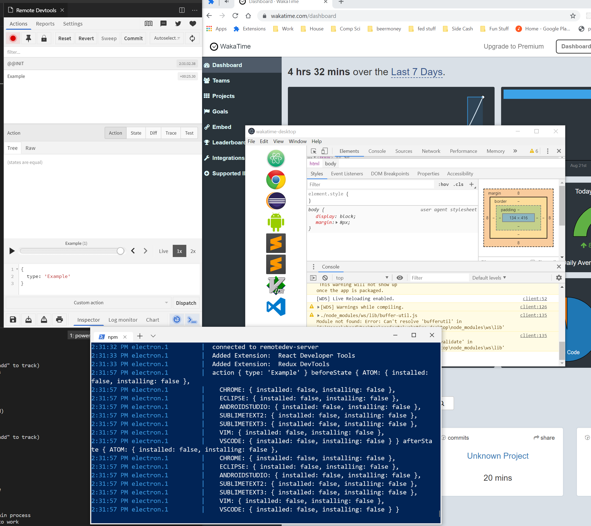
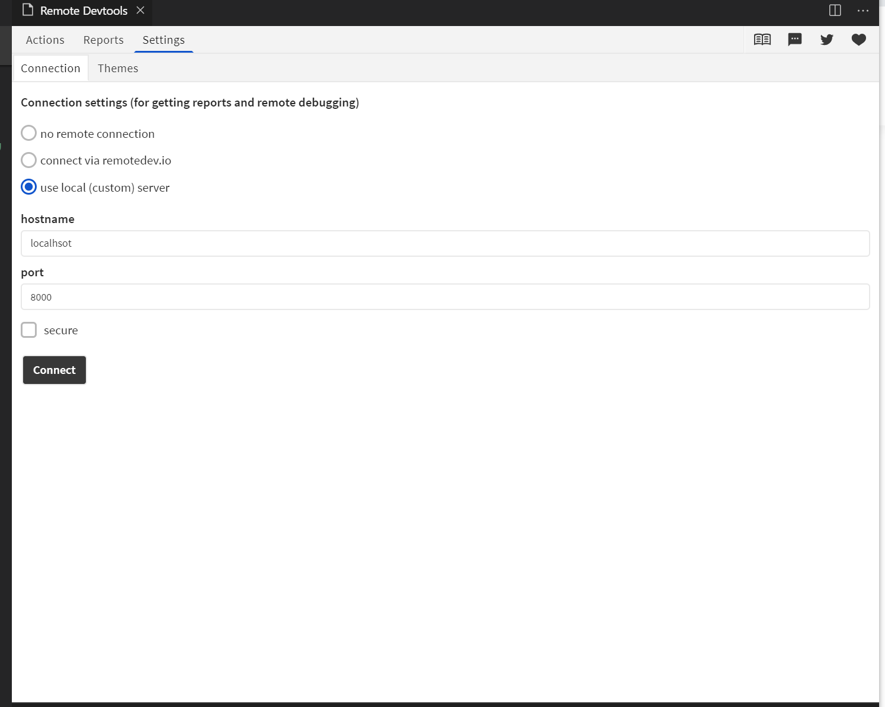

We have added [remote-redux-devtools](https://github.com/zalmoxisus/remote-redux-devtools) to allow the introspection of main process state.

In order to use this, you will need to install a version of the redux devtools.

1. [vscode](https://marketplace.visualstudio.com/items?itemName=jingkaizhao.vscode-redux-devtools)
2. [chrome](https://github.com/zalmoxisus/redux-devtools-extension)


Then configure your extension to point to

```host=localhost```

```port=8000```

